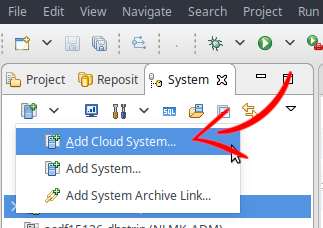

# 1. HANA - Getting started

This guide will describe how to create an account on HANA Trial website, install a working development environment and setup a minimal landscape to getting started smoothly.

## 1.1. SCP Trial

### 1.1.1. Account creation

Create an account on this website : https://account.hanatrial.ondemand.com and choose Neo Trial to create an HANA 1 trial tenant.

### 1.1.2. HANA tenant creation

Go to the "Databases & Schemas" area in the left menu.

And create a new tenant (several minutes).

I suggest to :

- configure the SHINE User as it will install the SHINE Delivery Unit, which contains multiples examples of artifacts, views, and so on...
- activate the DP Servert

## 1.2. Development environment

Even if theoricaly it's possible to only use the Worbench editor, I highly suggest to install HANA Studio as it's clearly more reliable for modeling with Calculation views, ...

### 1.2.1. HANA Studio

#### 1.2.1.1. Download & Installation

You will need 2 files from SAP Download center (you must be logged on SAP website) :

- SAPCAR (SAR archive utility) to extract HANA Studio : https://launchpad.support.sap.com/#/softwarecenter/search/sapcar
- HANA Studio : https://launchpad.support.sap.com/#/softwarecenter/search/IMC_STUDIO2_224

Copy both file on your harddrive and use sapcar to extract HANA Studio

By example, on Windows :

`SAPCAR_1211-80000938.EXE -xvf IMC_STUDIO2_224_9-80000323.SAR`

Then, go inside the extracted directory `SAP_HANA_STUDIO` and the run the installer `hdbinst.exe`

Use the default settings (see below)

Then, run HANA Studio and update it to the latest version.

#### 1.2.1.2. Install the SCP plugin

By default, HANA Studio can only connect to HANA on premise, so a plugin is required to connect.

First, you need to add additional repositories in HANA Studio.

Go in `Install new software...` and click on ADD button to add repositories.

Add the following list :

- Hana Neon : https://tools.hana.ondemand.com/neon/
- Hana Oxygen : https://tools.hana.ondemand.com/oxygen/
- Hana Mars : https://tools.hana.ondemand.com/mars/

And then, install the `SAP Cloud Platform Tools for Connecting to SAP HANA Systems` plugin.

#### 1.2.1.3. HANA Studio connection to SCP

Now, we need to add the newly created tenant in HANA Studio.

Click on `Add Cloud System`

Enter your Hana Trial Account credentials.

Select the tenant newly created and enter the tenant credentials entered in a previsous step.

The first time you will login, you will need to change the password.

When all the steps are done, you should see the tenant online (green bullet) in the left panel list.

You can repeat the same steps for the `SYSTEM` user, which is the only current user to have enough permissions to setup the initial landscape.

### 1.2.2. Workbench editor

HANA Studio is now installed, configured and connected, but we will also need the Workbench editor for many features, artifacts, and so on that are not supported in HANA Studio.

To access the Workbench editor, go back to the `Databases & Schemas area`

Enter the tenant

And then, you have access to the 4 tools :

- Editor : to edit all kind of artifacts (calculation views, replication tasks, XSJS, ....)
- Catalog : the SQL/Runtime tool, to query and browser Schemas, tables, remote sources, ...
- Security : to manage Users and Roles
- Trace : logs and traces

## 1.3. Initial landscape

Like for any platform, we need to setup an initial landscape about roles and permissions (admin, dev, user, ...).

### 1.3.1. HANA Lifecyle Management

You need to access the HANA Lifecyle Management to install the initial roles landscape delivery unit.

In HANA Studio, with the user `SYSTEM`, go to the security area and give the role `sap.hana.xs.lm.roles::Administrator` to your SHINE User newly created.

Then, in SCP, go to the HANA Cockpit dashboard

And then, go to the HANA Lifecycle Management

And finaly, go to the Delivery Unit area

Click on Import and import the Delivery Unit : `MYHANA_ROLES_Francois-B-Makoto.tgz` available here : [MYHANA_ROLES_Francois-B-Makoto.tgz](download/MYHANA_ROLES_Francois-B-Makoto.tgz)

It should look like this after the import :

The roles are now activated in HANA, so you can add the newly imported Admin Role `MyHANA.00Security.MyHANA_roles.roles.admin::MyHANA_roles_admin` to your SHINE User.

To proceed, go to HANA Studio with the `SYSTEM` user in the security area

You are now with the minimal landscape to begin any development on HANA :)

