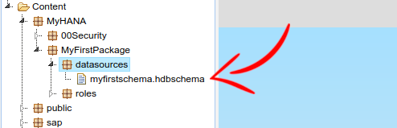

# 1. HANA - Let's start the development

In this section, we will see how to create a package and all its needed components for a specific development.

A Delivery Unit (DU) containing this guide's result : [MYHANA_MYFIRSTPACKAGE_Francois-B-Makoto.tgz](download/MYHANA_MYFIRSTPACKAGE_Francois-B-Makoto.tgz).

This DU can be imported in the HANA Lifecycle Management.

## 1.1. Create a custom package

First of all, we need a package, which will contain all artifacts related to a specific development.

Let's call it MyFirstPackage.

### 1.1.1. Root package

Create a package named `MyFirstPackage` inside `MyHANA`


### 1.1.2. Roles

Like for anything else, this package will need to manage permisssions about what user can do what.

In this guide, we will always segregate roles in 3 categories : `admin`, `developer` and `user`

#### 1.1.2.1. Roles package

So let's create a specific package named `roles` inside `MyFirstPackage`


#### 1.1.2.2. Define the roles

Now, let's define the role for the 3 kind of users, as described before.

Create 3 files (in text mode) named inside the package `roles`:

- `admin.hdbrole`
- `dev.hdbrole`
- `user.hdbrole`


##### 1.1.2.2.1. Admin role

Copy/Paste this code to the file `admin.hdbrole`

```
role MyHANA.MyFirstPackage.roles::admin
{
package MyHANA.MyFirstPackage: REPO.READ, REPO.ACTIVATE_NATIVE_OBJECTS, REPO.MAINTAIN_NATIVE_PACKAGES, REPO.ACTIVATE_IMPORTED_OBJECTS, REPO.MAINTAIN_IMPORTED_PACKAGES;
}
```

##### 1.1.2.2.2. Dev role

Copy/Paste this code to the file `dev.hdbrole`

```
role MyHANA.MyFirstPackage.roles::dev
{
package MyHANA.MyFirstPackage: REPO.READ, REPO.EDIT_NATIVE_OBJECTS, REPO.ACTIVATE_NATIVE_OBJECTS, REPO.MAINTAIN_NATIVE_PACKAGES, REPO.EDIT_IMPORTED_OBJECTS, REPO.ACTIVATE_IMPORTED_OBJECTS, REPO.MAINTAIN_IMPORTED_PACKAGES;
}
```

##### 1.1.2.2.3. User role

Copy/Paste this code to the file `user.hdbrole`

```
role MyHANA.MyFirstPackage.roles::user
{
package MyHANA.MyFirstPackage: REPO.READ;
}
```

#### 1.1.2.3. Assign the role to your user

The roles are now defined in HANA, but we still need to assign them to users.

In HANA Studio, with the `SYSTEM` user, assign the role `MyHANA.MyFirstPackage.roles::admin` to your SHINE User.


## 1.2. Create schema

We will now create a specific schema for our first development, which will contains our SQL Tables, ...

### 1.2.1. Datasources package

First, we will create a specific package for all datasources related artifacts : roles, schema definition, replication tasks, ....

So let's create a package named `datasources` in `MyFirstPackage`


### 1.2.2. Schema creation

We will now create a hdbschema artifact in order to create a schema in HANA.

Create a new file named `myfirstschema.hdbschema` in `datasources` packages



And copy/paste this in this file

```
schema_name="myfirstschema";
```

### 1.2.3. Schema roles

We now need to add roles for the schema too.

If you check on HANA Studio, you will notice you can't access the newly created schema.


Again, we will follow the same structure, with 3 kind of users : `admin`, `developer` and `user`

#### 1.2.3.1. Define the roles

Create 3 files (in text mode) named inside the package `datasources`:

- `admin.hdbrole`
- `dev.hdbrole`
- `user.hdbrole`

##### 1.2.3.1.1. Admin role

Copy/Paste this code to the file `admin.hdbrole`

```
role MyHANA.MyFirstPackage.datasources::admin
{
catalog schema "myfirstschema": SELECT, CREATE ANY, CREATE TEMPORARY TABLE, ALTER, DROP, EXECUTE, INSERT, UPDATE, DELETE, INDEX, TRIGGER, DEBUG, REFERENCES, SELECT METADATA, SELECT CDS METADATA;
}
```

##### 1.2.3.1.2. Dev role

Copy/Paste this code to the file `dev.hdbrole`

```
role MyHANA.MyFirstPackage.datasources::dev
{
catalog schema "myfirstschema": SELECT, CREATE ANY, CREATE TEMPORARY TABLE, ALTER, EXECUTE, INSERT, UPDATE, DELETE, INDEX, TRIGGER, DEBUG, REFERENCES, SELECT METADATA, SELECT CDS METADATA;
}
```

##### 1.2.3.1.3. User role

Copy/Paste this code to the file `user.hdbrole`

```
role MyHANA.MyFirstPackage.datasources::user
{
catalog schema "myfirstschema": SELECT, SELECT METADATA, SELECT CDS METADATA;
}
```

#### 1.2.3.2. Assign the role to your user

We need now to assign this newly created role to your SHINE user, the same way you did for the package role, but we will use a different way in this case.

In order to make the role mamagement about users easier, we will include the schema role within the package role.

By doing this, we just need to assign the package role to a user and update it regarding furthure updates, new schema roles, ....

##### 1.2.3.2.1. Extend package admin role with Schema admin role

In the package MyFirstPackage.roles, open the file `admin.hdbrole`

And extend the role in the header like this :

```
role MyHANA.MyFirstPackage.roles::admin extends role
    MyHANA.MyFirstPackage.datasources::admin
{
package MyHANA.MyFirstPackage: REPO.READ, REPO.ACTIVATE_NATIVE_OBJECTS, REPO.MAINTAIN_NATIVE_PACKAGES, REPO.ACTIVATE_IMPORTED_OBJECTS, REPO.MAINTAIN_IMPORTED_PACKAGES;
}
```

##### 1.2.3.2.2. Extend package dev role with Schema dev role

In the package MyFirstPackage.roles, open the file `dev.hdbrole`

And extend the role in the header like this :

```
role MyHANA.MyFirstPackage.roles::dev extends role
    MyHANA.MyFirstPackage.datasources::dev
{
package MyHANA.MyFirstPackage: REPO.READ, REPO.EDIT_NATIVE_OBJECTS, REPO.ACTIVATE_NATIVE_OBJECTS, REPO.MAINTAIN_NATIVE_PACKAGES, REPO.EDIT_IMPORTED_OBJECTS, REPO.ACTIVATE_IMPORTED_OBJECTS, REPO.MAINTAIN_IMPORTED_PACKAGES;
}
```

##### 1.2.3.2.3. Extend package user role with Schema user role

In the package MyFirstPackage.roles, open the file `user.hdbrole`

And extend the role in the header like this :

```
role MyHANA.MyFirstPackage.roles::user extends role
    MyHANA.MyFirstPackage.datasources::user
{
package MyHANA.MyFirstPackage: REPO.READ;
}
```

#### 1.2.3.3. Schema access check

Now, let's see if we can access the schema.

Go back in HANA Studio with you SHINE User and refresh the catalog area.

If everything is fine, you should see this :


