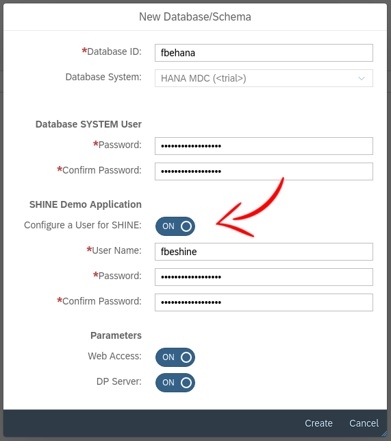
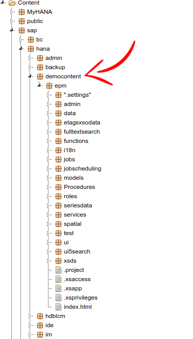
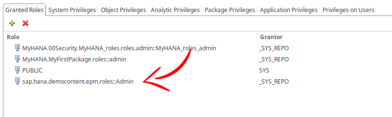
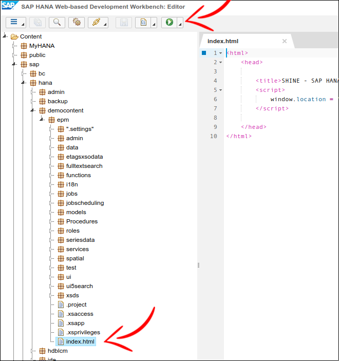
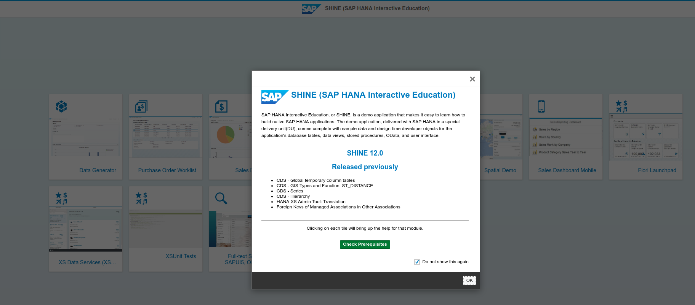

# 1. SHINE

## 1.1. Introduction

This guide will make a small introduction to the SHINE delivery unit.

SHINE is a complete set of all kind of artifacts/development in HANA.

It's a very usefull source/reference to understand HANA with the biggest advantage (compared to all docs on the internet) that what you will find there is full working.

## 1.2. Installation

If you remember the tenant creation process (see below), we have configured a SHINE user.

This user was created at the same time that the SHINE delivery unit was installed on the system.

So, if you have configured the SHINE user at the tenant creation time, you can directly jump to the role part of the guide (but I advice to read the whole doc as information ;)), otherwise, keep reading this section.

To install SHINE manually, download this delivery unit ([HCO_DEMOCONTENT_200.tgz](https://launchpad.support.sap.com/#/softwarecenter/search/HCODEMOCONTENT200)) and install it in the HANA Lifecycle Management (see previous guide for how to install DU).

Once this delivery unit is installed, you will see a package named `democontent` inside the `sap.hana` package hiearchy in the Workbench editor.

This is where you will have to search all artifacts and study their source code.

## 1.3. Role

To use the SHINE dashboard and play with all the kind of artifacts, you will need a specific role, which is provided by the delivery unit at installation.

As seen previously, go to HANA studio in the security area, and assign this role `sap.hana.democontent.epm.roles::Admin` to your SHINE user.

## 1.4. SHINE Dashboad

Then, you can now access the SHINE Dashboard now.

Go inside the package `sap.hana.democontent.epm`, open `index.html` and just click on the Play button.

You are now in the SHINE Dashboard and can explore the different demos available.

